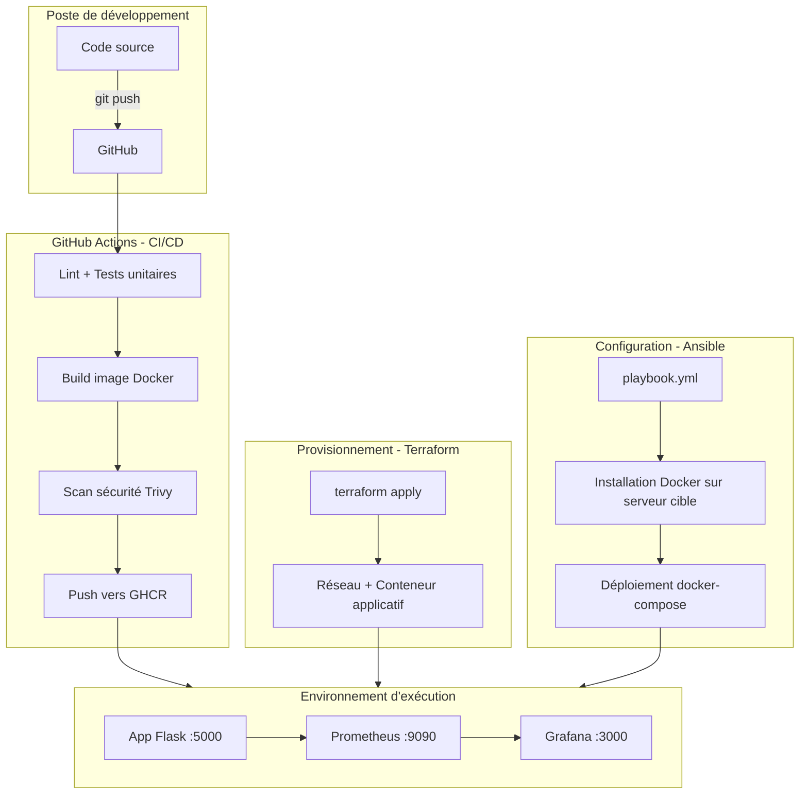

# Architecture

## Flux logique

1. **Développement** : le code est versionné sur GitHub.
2. **Intégration continue** : chaque push déclenche lint, tests, build de l'image, scan de vulnérabilités (Trivy) et publication sur le registre (GHCR).
3. **Provisionnement (IaC)** : Terraform décrit l'infrastructure cible de façon déclarative (ici le provider Docker en local, transposable à un provider cloud comme AWS/OVH/Scaleway sans changer la logique).
4. **Configuration (CM)** : Ansible installe et configure Docker sur le serveur cible, puis déploie la stack.
5. **Observabilité** : Prometheus scrape les métriques exposées par l'application, Grafana les visualise en dashboards.

## Pourquoi cette stack

- **Terraform + Ansible** : sépare clairement le "provisionnement" (quoi créer) de la "configuration" (comment le régler), une distinction que les recruteurs DevOps/SysOps vérifient systématiquement.
- **Scan de sécurité intégré à la CI** : reflète une logique "shift-left security", cohérente avec un environnement type SecNumCloud.
- **Monitoring dès le départ** : montre une compréhension de l'observabilité, pas seulement du déploiement.
